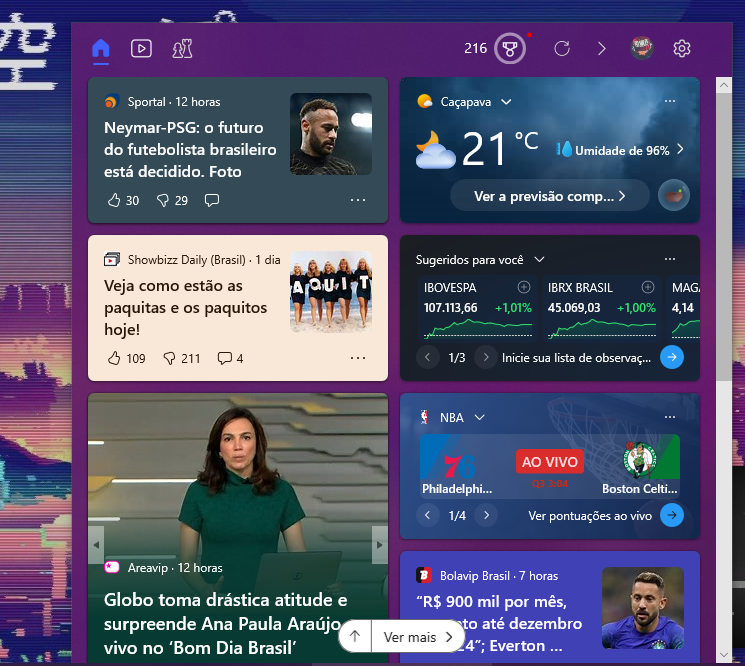
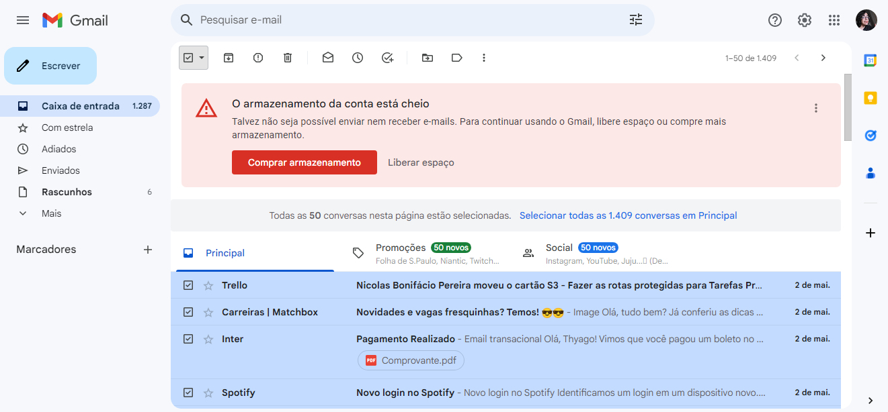
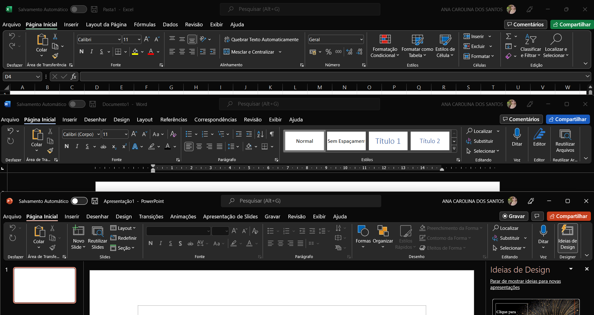
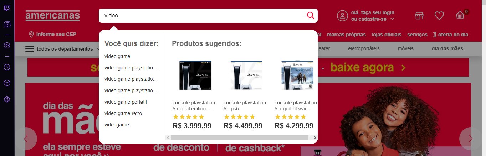
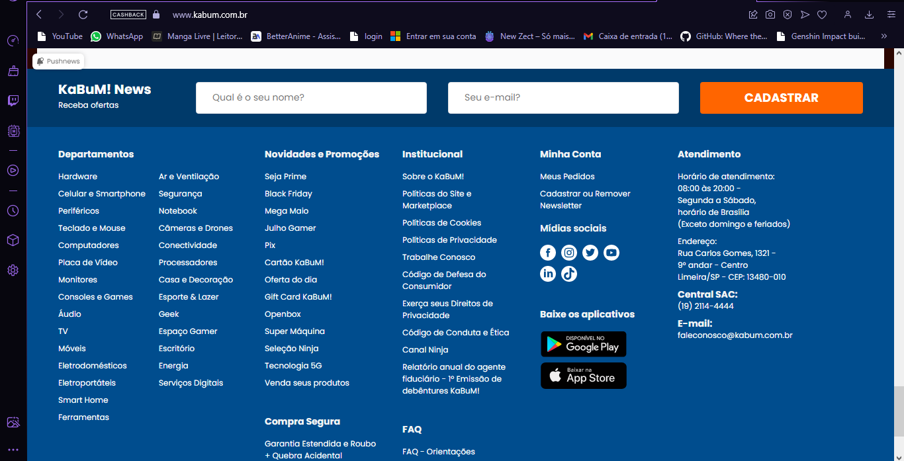

# Análise de interfaces com base nas Heurísticas de Jakob Nielsen

### 1 - Visibilidade do status do sistema

Esta heurística diz respeito ao fator da pessoa usuária poder diagnosticar na interface, por si só, sem a necessidade de ajuda extra, o que está acontecendo na interface. Entendendo o status da interface, a pessoa poderá decidir com mais facilidade quais passos deseja tomar em seguida.

Um exemplo deste heurística é a interface do YouTube, que ao longo do vídeo mostra o progresso deste mesmo, dando ao usuário a visibilidade de início e fim. Também disponibiliza as opções de pausar, avançar, aumentar e diminuir volume, entre outras opções para melhor a imersão do usuário na plataforma.

### 2 - Relação entre o sistema e o mundo real

O sistema deve ter a mesma linguagem que seu usuário utiliza no dia a dia, portanto utilizar palavras, frases, imagens e conceitos que sejam familiares ao usuário. Também é recomendável a utilização de ícones que representem uma ação para realizar essa correspondência.

Neste exemplo, temos a interfaca de rápido acesso que é disponibilizada nos computadores, a interface de previsão e notícias. Nela aparece as principais notícias que ocorreram nos ultimos dias, além de ter um ícone onde mostra a previsão do tempo, podendo "bater o olho" e já entender como está o clima.

### 3 - Liberdade e controle do usuário

No sistema é importante que o usuário tenha liberdade para realizar ações que ele deseja, porém muitas vezes essas ações são realizadas por engano, nessas situações deve haver uma “saída de emergência” de fácil localização, permitindo que o usuário saia daquela janela indesejada ou retorne ao ponto anterior.

O Gmail nos fornece a opção de selecionar diversos e-mails para uma excluir vários aos mesmo tempo, e quando é selecionado a caixinha fica preenchida e as linhas dos e-mail ficam marcadas com um fundo azul, mostrando que elas estão selecionadas. E após excluir os e-mails, aparece a opção para desfazer, caso o usuário queira recuperar um arquivo que excluiu acidentalmente.

### 4 - Padrões e Consistências

Não devemos deixar o usuário em dúvida se palavras, situações ou ações diferentes tem o mesmo significado, para isso a interface deve manter uma consistência, permitindo que o usuário identifique os padrões de estética, interação e informação existentes nesta.

Os programas da Microsoft seguem padrões, sendo que os itens do menu ficam sempre na parte superior, os ícones que realizam a mesma ação são repetidos em todas as interfaces, como os da seção Clipboard, em que a tipografia é a mesma e mantém o mesmo tamanho e cor.

### 5 - Prevenção a erros

Essa heurística foca em criar uma plataforma que busca prevenir que problemas ocorram, eliminando condições mais propensas ao erro, isso pode ser feito sinalizando ações como quando o usuário não finalizou uma tarefa e pede para sair da página ou oferecendo a ele uma opção de confirmação antes de completar uma ação.

O site das Lojas Americanas nos mostra ao digitar uma popup com varias opções relacionadas ao que o usuário digitou, evitando que digite errado e faça uma pesquisa que não localize o produto.

### 6 - Reconhecimento em vez de memorização

Devemos minimizar a quantidade de informações que o usuário precisa memorizar, para isso, objetos, ações e opções importantes devem ficar visíveis, isso faz com que o cérebro perceba as ações que são similares, reconhecendo assim padrões.

Na Kabum por exemplo, temos acesso a um histórico de compras, que permite nós usuários visualizar com detalhes os produtos que adquirimos no passado.

### 10 – Ajuda e documentação

Nunca sabemos quando um usuário vai precisar de um auxílio, embora as áreas de documentação e ajuda sejam as menos acessadas, elas devem estar lá, principalmente em interfaces que possuem muitas possibilidades, pois podem ajudar o usuário a resolver um problema sozinho.  

O site da Kabum, por exemplo, possui um footer no final de sua página onde disponibiliza aos usuários várias opções, com relação ao intuito do próprio site (neste caso um e-commerce) e também opções relacionadas às dúvidas como o FAQ.
